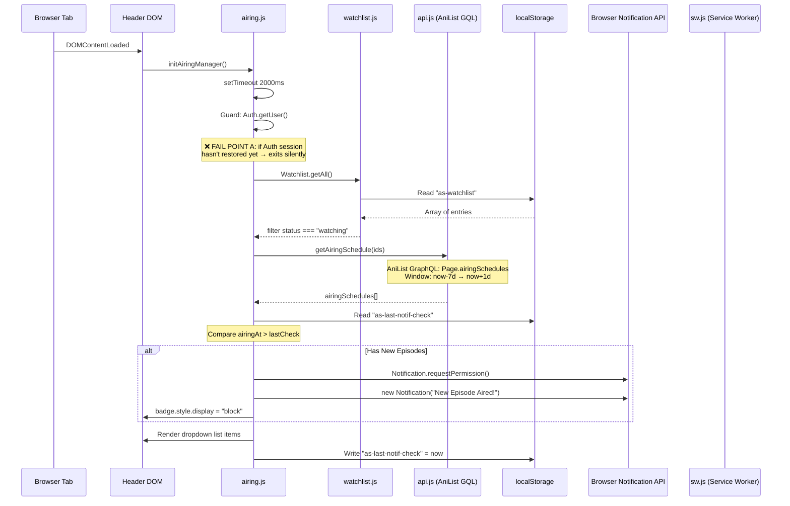

# 🔔 AniSmoke — Notification System Audit

> **Scope:** Read-only analysis of the entire notification delivery pipeline.  
> **Date:** 2026-05-25  
> **Status:** No code modifications made.

---

## 1. Architecture Map



### Component Responsibilities

| Component | File | Role |
|-----------|------|------|
| **Airing Manager** | [`airing.js`](file:///e:/Projects/AniSmoke/js/airing.js) | Orchestrator — polls schedule, renders dropdown, fires browser notifications |
| **Watchlist** | [`watchlist.js`](file:///e:/Projects/AniSmoke/js/watchlist.js) | Provides the list of anime IDs with status `watching` |
| **API Layer** | [`api.js`](file:///e:/Projects/AniSmoke/js/api.js#L386-L401) | `getAiringSchedule()` — queries AniList for recent airing times |
| **Auth** | [`app.js`](file:///e:/Projects/AniSmoke/js/app.js#L22-L101) | `Auth.getUser()` — gates the entire notification flow |
| **Supabase Client** | [`supabase.js`](file:///e:/Projects/AniSmoke/js/supabase.js) | Provides session/auth state. Not directly involved in notifications. |
| **Service Worker** | [`sw.js`](file:///e:/Projects/AniSmoke/sw.js) | Caches static assets. **Does NOT handle push events.** |
| **localStorage** | — | Stores `as-last-notif-check` (epoch) and `as-watchlist` (JSON array) |

---

## 2. Root Cause Analysis — Failure Points

### ❌ CRITICAL: No Server-Side Push Notification Infrastructure

> [!CAUTION]
> The entire notification system is **client-side only**. There is **no server-side push infrastructure** — no Web Push API subscription, no VAPID keys, no Supabase Edge Function, no cron job. Notifications **only fire when the user has the tab actively open**.

| ID | Failure Point | Severity | Location | Description |
|----|---------------|----------|----------|-------------|
| **F1** | **No Web Push / service worker push handler** | 🔴 Critical | [`sw.js`](file:///e:/Projects/AniSmoke/sw.js) | The service worker has no `push` event listener. No `PushManager.subscribe()` anywhere in the codebase. Notifications cannot be delivered when the tab is closed. |
| **F2** | **Auth race condition** | 🔴 Critical | [`airing.js:134`](file:///e:/Projects/AniSmoke/js/airing.js#L134) | `Auth.getUser()` is checked after a fixed 2000ms `setTimeout`. If Supabase session restoration takes longer (slow network, PKCE exchange), the guard fails silently — no schedule check ever runs. |
| **F3** | **No retry or re-check logic** | 🟠 High | [`airing.js:133-135`](file:///e:/Projects/AniSmoke/js/airing.js#L133-L135) | `checkSchedule()` runs **exactly once** per page load (after the 2000ms delay). If it fails (network error, auth not ready), there's no retry. The user must reload the page. |
| **F4** | **localStorage-based watchlist for guests** | 🟠 High | [`watchlist.js:51`](file:///e:/Projects/AniSmoke/js/watchlist.js#L51) | If cloud sync hasn't completed when `checkSchedule()` runs, it reads stale/empty localStorage data. The watchlist may report 0 "watching" items, silently aborting the check. |
| **F5** | **lastCheck timestamp set too eagerly** | 🟡 Medium | [`airing.js:125`](file:///e:/Projects/AniSmoke/js/airing.js#L125) | `as-last-notif-check` is set to `now` even if the user never opened the dropdown. Opening the same page minutes later shows everything as "read," despite the user never seeing the notifications. |
| **F6** | **No duplicate notification prevention** | 🟡 Medium | [`airing.js:82-86`](file:///e:/Projects/AniSmoke/js/airing.js#L82-L86) | Opening two tabs simultaneously both fire `new Notification(...)` for the same newest episode, creating duplicate OS-level notifications. No `tag` property is used on the Notification. |
| **F7** | **Permission request timing** | 🟡 Medium | [`airing.js:77-79`](file:///e:/Projects/AniSmoke/js/airing.js#L77-L79) | `Notification.requestPermission()` is called silently with no user context. Many browsers block permission requests that aren't triggered by a direct user gesture. |
| **F8** | **No notification history persistence** | 🟡 Medium | [`airing.js:90-122`](file:///e:/Projects/AniSmoke/js/airing.js#L90-L122) | The dropdown list is rebuilt from the API every page load. There's no Supabase table storing notification history. If the API is unreachable, the dropdown is empty. |
| **F9** | **Timezone handling** | 🟢 Low | [`airing.js:57`](file:///e:/Projects/AniSmoke/js/airing.js#L57) | `Math.floor(Date.now() / 1000)` uses the device's local clock. AniList `airingAt` is in UTC epoch seconds. This is correct, but the "time ago" display doesn't account for clock skew. |
| **F10** | **AniList rate limiting** | 🟢 Low | [`api.js:393-396`](file:///e:/Projects/AniSmoke/js/api.js#L393-L396) | The 20-ID chunking is good, but if a user has 100+ watching items, that's 5+ sequential GraphQL queries with no rate-limit backoff, risking a 429 error that silently fails. |

---

## 3. Database Schema Review

### Current Supabase Table: `watchlists`

Inferred schema from [`supabase.js:193-205`](file:///e:/Projects/AniSmoke/js/supabase.js#L193-L205):

| Column | Type | Notes |
|--------|------|-------|
| `user_id` | UUID (FK → auth.users) | Part of composite PK |
| `anime_id` | TEXT | Part of composite PK (AniList ID as string) |
| `title` | TEXT | |
| `cover` | TEXT | URL |
| `format` | TEXT | TV, MOVIE, OVA, etc. |
| `total_episodes` | INTEGER | |
| `year` | INTEGER | |
| `score` | INTEGER | AniList average score |
| `status` | TEXT | watching, completed, etc. |
| `progress` | INTEGER | Episodes watched |
| `added_at` | TIMESTAMPTZ | Auto-generated |
| `last_watched_at` | TIMESTAMPTZ | Nullable |

> **Unique Constraint:** `(user_id, anime_id)` — used for upsert conflict resolution.

### Missing Tables for Notifications

> [!IMPORTANT]
> **No `notifications` table exists.** No `push_subscriptions` table exists. No `notification_preferences` table exists.

For a working notification system, the following tables would be needed:

```sql
-- 1. Push subscription endpoints (Web Push API)
CREATE TABLE push_subscriptions (
  id UUID DEFAULT gen_random_uuid() PRIMARY KEY,
  user_id UUID REFERENCES auth.users(id) ON DELETE CASCADE,
  endpoint TEXT NOT NULL,
  p256dh TEXT NOT NULL,
  auth_key TEXT NOT NULL,
  user_agent TEXT,
  created_at TIMESTAMPTZ DEFAULT now(),
  UNIQUE(user_id, endpoint)
);

-- 2. Notification log (dedup + history)
CREATE TABLE notification_log (
  id UUID DEFAULT gen_random_uuid() PRIMARY KEY,
  user_id UUID REFERENCES auth.users(id) ON DELETE CASCADE,
  anime_id TEXT NOT NULL,
  episode INTEGER NOT NULL,
  notified_at TIMESTAMPTZ DEFAULT now(),
  channel TEXT DEFAULT 'browser',  -- browser, push, email
  UNIQUE(user_id, anime_id, episode)  -- prevents duplicates
);

-- 3. User notification preferences
CREATE TABLE notification_preferences (
  user_id UUID REFERENCES auth.users(id) ON DELETE CASCADE PRIMARY KEY,
  push_enabled BOOLEAN DEFAULT true,
  email_enabled BOOLEAN DEFAULT false,
  quiet_hours_start TIME,      -- e.g. 22:00
  quiet_hours_end TIME,        -- e.g. 08:00
  timezone TEXT DEFAULT 'UTC'
);
```

---

## 4. Missing Environment Variables

| Variable | Required For | Status |
|----------|-------------|--------|
| `SUPABASE_URL` | Auth, DB sync | ✅ Present in `.env.example` and `generate-config.js` |
| `SUPABASE_ANON_KEY` | Auth, DB sync | ✅ Present in `.env.example` and `generate-config.js` |
| `ANISMOKE_CONSUMET` | Stream backup | ✅ Present (optional) |
| **`VAPID_PUBLIC_KEY`** | Web Push subscription | ❌ **Missing** — required for `PushManager.subscribe()` |
| **`VAPID_PRIVATE_KEY`** | Server-side push sending | ❌ **Missing** — required for Supabase Edge Function to send pushes |
| **`SUPABASE_SERVICE_ROLE_KEY`** | Edge Function DB access | ❌ **Missing** — needed for server-side cron to query watchlists |

---

## 5. Implementation Plan — Fix Notification Delivery

### Phase A: Fix Client-Side Issues (Quick Wins)

> These can be done immediately without any new infrastructure.

#### A1. Fix auth race condition ([`airing.js:133-135`](file:///e:/Projects/AniSmoke/js/airing.js#L133-L135))

**Problem:** Hard `setTimeout(2000)` may fire before session is restored.

**Fix:** Listen for the `auth-state-change` custom event instead:
```diff
-  setTimeout(() => {
-    if (window.Auth && window.Auth.getUser()) checkSchedule();
-  }, 2000);
+  // Run when auth confirms a signed-in user
+  window.addEventListener('auth-state-change', function handler(e) {
+    if (e.detail?.user) {
+      window.removeEventListener('auth-state-change', handler);
+      checkSchedule();
+    }
+  });
+  // Fallback: if auth is already resolved
+  setTimeout(() => {
+    if (window.Auth?.getUser()) checkSchedule();
+  }, 3000);
```

#### A2. Add Notification `tag` for deduplication ([`airing.js:82-86`](file:///e:/Projects/AniSmoke/js/airing.js#L82-L86))

```diff
  new Notification("New Episode Aired!", {
    body: `${newest.media?.title?.english || ...} - Episode ${newest.episode}`,
-   icon: newest.media?.coverImage?.large
+   icon: newest.media?.coverImage?.large,
+   tag: `anismoke-ep-${newest.mediaId}-${newest.episode}`
  });
```

#### A3. Defer lastCheck update to dropdown open ([`airing.js:125`](file:///e:/Projects/AniSmoke/js/airing.js#L125))

Move `localStorage.setItem('as-last-notif-check', ...)` into the bell button's click handler instead of `checkSchedule()`.

#### A4. Request notification permission on user gesture ([`airing.js:77-79`](file:///e:/Projects/AniSmoke/js/airing.js#L77-L79))

Move `Notification.requestPermission()` to the bell button click or a dedicated "Enable Notifications" button, not the auto-check function.

---

### Phase B: Add Periodic Re-Check

#### B1. Schedule re-checks via `setInterval`

```js
// In initAiringManager, after first checkSchedule succeeds:
setInterval(checkSchedule, 15 * 60 * 1000); // Re-check every 15 minutes
```

#### B2. Add exponential backoff on API failure

Wrap the catch block in `checkSchedule()` with a retry counter that backs off (2s → 4s → 8s → give up).

---

### Phase C: Server-Side Push Notifications (Full Fix)

> [!WARNING]
> This requires new Supabase infrastructure. Without it, notifications only work while the tab is open.

| Step | Component | File(s) to Create/Edit |
|------|-----------|----------------------|
| C1 | Generate VAPID key pair | CLI: `npx web-push generate-vapid-keys` |
| C2 | Add `VAPID_PUBLIC_KEY` and `VAPID_PRIVATE_KEY` to `.env` | [`.env.example`](file:///e:/Projects/AniSmoke/.env.example), [`generate-config.js`](file:///e:/Projects/AniSmoke/generate-config.js) |
| C3 | Create `push_subscriptions` table in Supabase | Supabase Dashboard → SQL Editor |
| C4 | Create `notification_log` table in Supabase | Supabase Dashboard → SQL Editor |
| C5 | Add `PushManager.subscribe()` to client | [`airing.js`](file:///e:/Projects/AniSmoke/js/airing.js) — new function `subscribeToPush()` |
| C6 | Store push subscription in Supabase | [`supabase.js`](file:///e:/Projects/AniSmoke/js/supabase.js) — new `PushDB.save()` method |
| C7 | Add `push` event listener to service worker | [`sw.js`](file:///e:/Projects/AniSmoke/sw.js) — `self.addEventListener('push', ...)` |
| C8 | Create Supabase Edge Function `notify-episodes` | **[NEW]** `supabase/functions/notify-episodes/index.ts` |
| C9 | Set up Supabase cron (pg_cron) to call edge function | Supabase Dashboard → Database → Extensions → pg_cron |
| C10 | Add `notificationclick` handler to SW | [`sw.js`](file:///e:/Projects/AniSmoke/sw.js) — opens `watch.html?id=...` |

#### Edge Function Pseudocode (C8)

```typescript
// supabase/functions/notify-episodes/index.ts
import { createClient } from '@supabase/supabase-js';
import webPush from 'web-push';

Deno.serve(async () => {
  const supabase = createClient(SUPABASE_URL, SUPABASE_SERVICE_ROLE_KEY);

  // 1. Get all users with status='watching'
  const { data: watchers } = await supabase
    .from('watchlists')
    .select('user_id, anime_id')
    .eq('status', 'watching');

  // 2. Group anime_ids, query AniList for recent airings
  // 3. For each (user, anime, episode) combo:
  //    a. Check notification_log for duplicates
  //    b. Fetch push_subscriptions for user
  //    c. Send web push via webPush.sendNotification()
  //    d. Insert into notification_log

  return new Response('OK');
});
```

---

## 6. Exact Files to Edit

### Quick Fixes (Phase A + B)

| File | Line(s) | Change |
|------|---------|--------|
| [`js/airing.js`](file:///e:/Projects/AniSmoke/js/airing.js#L77-L79) | 77-79 | Move `requestPermission()` to user gesture |
| [`js/airing.js`](file:///e:/Projects/AniSmoke/js/airing.js#L82-L86) | 82-86 | Add `tag` to `new Notification()` |
| [`js/airing.js`](file:///e:/Projects/AniSmoke/js/airing.js#L125) | 125 | Move `lastCheck` write to dropdown open handler |
| [`js/airing.js`](file:///e:/Projects/AniSmoke/js/airing.js#L133-L136) | 133-136 | Replace `setTimeout` with `auth-state-change` listener |

### Full Push Notification System (Phase C)

| File | Action | Change |
|------|--------|--------|
| [`.env.example`](file:///e:/Projects/AniSmoke/.env.example) | MODIFY | Add `VAPID_PUBLIC_KEY` and `VAPID_PRIVATE_KEY` |
| [`generate-config.js`](file:///e:/Projects/AniSmoke/generate-config.js) | MODIFY | Include `VAPID_PUBLIC_KEY` in config output |
| [`js/airing.js`](file:///e:/Projects/AniSmoke/js/airing.js) | MODIFY | Add `subscribeToPush()`, store subscription |
| [`js/supabase.js`](file:///e:/Projects/AniSmoke/js/supabase.js) | MODIFY | Add `PushDB` module (save/delete subscription) |
| [`sw.js`](file:///e:/Projects/AniSmoke/sw.js) | MODIFY | Add `push` + `notificationclick` event listeners |
| [`site.webmanifest`](file:///e:/Projects/AniSmoke/site.webmanifest) | MODIFY | Add `"gcm_sender_id"` if using FCM (optional) |
| `supabase/functions/notify-episodes/index.ts` | **NEW** | Edge function — query watchers, send pushes |
| Supabase SQL | **NEW** | Create `push_subscriptions` + `notification_log` tables |
| Supabase cron | **NEW** | `SELECT cron.schedule('*/30 * * * *', ...)` — every 30 mins |

---

## 7. Summary

| Category | Status |
|----------|--------|
| **UI (bell + dropdown)** | ✅ Working — renders correctly when data is available |
| **Watchlist → IDs** | ✅ Working — filters `status === 'watching'` correctly |
| **AniList Airing Query** | ✅ Working — 7-day window query is correct |
| **Auth gating** | 🔴 **Race condition** — 2s timeout may fire before session restore |
| **Browser `Notification` API** | 🟡 **Works but fragile** — no dedup, bad permission timing |
| **Push when tab closed** | 🔴 **Completely missing** — no Web Push, no SW handler, no server |
| **Supabase tables** | 🔴 **No notification tables** — only `watchlists` exists |
| **Edge Function / Cron** | 🔴 **Does not exist** — no server-side notification sender |
| **VAPID keys** | 🔴 **Missing** — not in `.env` or config |
| **Retry / backoff** | 🔴 **None** — single attempt, silent failure |
| **Duplicate prevention** | 🟡 **Client-side only** — no `tag`, no server-side dedup table |
| **Timezone** | ✅ Correct — uses UTC epoch seconds throughout |

> [!IMPORTANT]
> **Bottom line:** The notification system only works as an in-page poll — a "what aired recently" dropdown. It cannot deliver notifications when the tab is closed, which is what most users expect from a "notification" feature. Fixing this requires building a server-side push pipeline (VAPID keys → Edge Function → Web Push API → Service Worker push handler).
