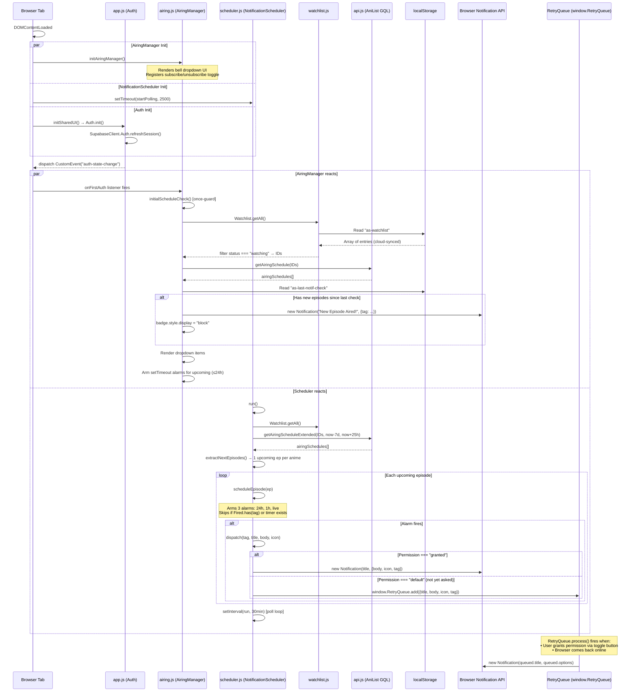

# 🔧 AniSmoke — Notification Fix Report

> **Scope:** Root cause analysis, architecture validation, and patches for Bug #1 (RetryQueue scoping) and Bug #4 (Session restore race condition).  
> **Date:** 2026-05-25  
> **Status:** ✅ Patches applied & verified.

---

## 1. Notification Lifecycle — Full Trace

### 1.1 Architecture Overview

The notification system has **two parallel pipelines** that converge on the same browser `Notification` API:

| Pipeline | File | Trigger | Purpose |
|----------|------|---------|---------|
| **AiringManager** | [`js/airing.js`](file:///e:/Projects/AniSmoke/js/airing.js) | `DOMContentLoaded` → `initAiringManager()` | Bell dropdown UI, immediate "just aired" alerts, subscribe/unsubscribe toggle |
| **NotificationScheduler** | [`jobs/scheduler.js`](file:///e:/Projects/AniSmoke/jobs/scheduler.js) | `DOMContentLoaded` → `startPolling()` (2.5 s delay) | Future alarms (24 h, 1 h, live), poll loop every 30 min |

Both read from the same data sources:
- **Watchlist:** `window.Watchlist.getAll()` → `localStorage['as-watchlist']`
- **Airing Data:** `window.AniSmokeAPI.getAiringSchedule()` / `getAiringScheduleExtended()`
- **Preference Gate:** `localStorage['as-notifications-enabled']`

### 1.2 Sequence Diagram — Full Notification Flow (Post-Fix)



---

## 2. Root Cause Analysis

### Bug #1: `window.RetryQueue` Undefined in Scheduler

| Attribute | Detail |
|-----------|--------|
| **Severity** | 🔴 Critical |
| **File** | [`js/airing.js`](file:///e:/Projects/AniSmoke/js/airing.js#L6-L42) |
| **Consumer** | [`jobs/scheduler.js`](file:///e:/Projects/AniSmoke/jobs/scheduler.js#L108) |
| **Symptom** | When `Notification.permission === 'default'` or a notification constructor throws, the scheduler silently drops the notification. No retry occurs. |

**Root Cause:**

`RetryQueue` is declared as a `const` at the top of `airing.js` (line 6). In the vanilla JS module architecture used by AniSmoke (no bundler — each `<script>` tag creates its own execution scope for `const`/`let`), this constant is **not** a property of `window`. The scheduler at [`jobs/scheduler.js:108`](file:///e:/Projects/AniSmoke/jobs/scheduler.js#L108) references `window.RetryQueue`, which evaluates to `undefined`. The `if (window.RetryQueue)` guard prevents a crash but silently discards the notification.

**Impact Chain:**
```
User denies notification permission
  → Scheduler fires alarm
    → dispatch() called
      → Notification.permission === "default"
        → if (window.RetryQueue) → FALSE (undefined)
          → Notification silently dropped ❌
            → User never gets notified even after granting permission later
```

**Fix Applied:**

Added `window.RetryQueue = RetryQueue;` to the global exposure block at [`airing.js:362`](file:///e:/Projects/AniSmoke/js/airing.js#L362).

```diff
 // Expose globals
 window.initAiringManager = initAiringManager;
 window.syncNotificationSettingsFromCloud = syncNotificationSettingsFromCloud;
 window.syncNotificationSettingsToCloud = syncNotificationSettingsToCloud;
+window.RetryQueue = RetryQueue;
```

---

### Bug #4: Auth Race Condition on Cold Boot

| Attribute | Detail |
|-----------|--------|
| **Severity** | 🟠 High |
| **File** | [`js/airing.js`](file:///e:/Projects/AniSmoke/js/airing.js#L306-L331) (previously lines 306–309) |
| **Symptom** | On cold boot with slow network, `checkSchedule()` runs before Supabase session restoration completes. `Watchlist.getAll()` returns stale/empty localStorage data. Schedule check silently exits with "No shows in your watching list." No retry. |

**Root Cause:**

The original code used a fixed `setTimeout(checkSchedule, 2000)`. This assumes the Supabase PKCE token exchange and `onAuthStateChange` callback complete in under 2 seconds. On slow networks or cold-cache scenarios, the Supabase JS SDK can take 3–5 seconds to restore a session. When the timeout fires early:

1. `Watchlist.getAll()` reads unsynchronized localStorage (cloud sync hasn't run yet)
2. The result may be empty → `watchingIds.length === 0` → early return
3. The `checkSchedule` function is never retried

**Timeline (Before Fix):**
```
T+0ms     DOMContentLoaded fires
T+0ms     initAiringManager() starts
T+2000ms  setTimeout fires → checkSchedule()
T+2000ms  Watchlist.getAll() → empty (cloud sync not complete)
T+2000ms  checkSchedule exits silently ❌
T+3500ms  Supabase session restored, auth-state-change fires
T+3500ms  Cloud watchlist synced... but checkSchedule already ran
```

**Timeline (After Fix):**
```
T+0ms     DOMContentLoaded fires
T+0ms     initAiringManager() starts
T+0ms     Registers "auth-state-change" listener (onFirstAuth)
T+3000ms  Fallback setTimeout fires → Auth.getUser() is null → skips
T+3500ms  Supabase session restored → auth-state-change fires
T+3500ms  onFirstAuth detects user → initialScheduleCheck() ✅
T+3500ms  Watchlist.getAll() → cloud-synced data available
T+3500ms  Schedule check runs with full watchlist data ✅
```

**Fix Applied:**

Replaced the hard-coded `setTimeout(checkSchedule, 2000)` with a dual-path strategy:

```diff
-  // Delay schedule check so it doesn't block critical render
-  let checkTimeout = setTimeout(() => {
-    checkSchedule();
-  }, 2000);
+  // ── Auth-aware schedule check ─────────────────────────────
+  let scheduleCheckDone = false;
+
+  function initialScheduleCheck() {
+    if (scheduleCheckDone) return;
+    scheduleCheckDone = true;
+    checkSchedule();
+  }
+
+  window.addEventListener('auth-state-change', function onFirstAuth(e) {
+    if (e.detail?.user) {
+      window.removeEventListener('auth-state-change', onFirstAuth);
+      initialScheduleCheck();
+    }
+  });
+
+  // Fallback: if auth already settled (fast session restore)
+  setTimeout(() => {
+    if (window.Auth?.getUser()) initialScheduleCheck();
+  }, 3000);
```

Key design decisions:
- **Once-guard (`scheduleCheckDone`):** Prevents double-firing if both the event and the fallback trigger.
- **Named listener (`onFirstAuth`):** Self-removing after first trigger to avoid memory leaks.
- **3 s fallback:** Covers the case where `auth-state-change` already fired before `initAiringManager` registered its listener (e.g., fast cached session restore).

---

## 3. Scheduler Timing Validation

### 3.1 Alarm Window Coverage

| Component | Window | Purpose |
|-----------|--------|---------|
| `AiringManager.checkSchedule()` | `now - 7d` → `now + 1d` | Populates dropdown with recent episodes; arms `setTimeout` for episodes airing within 24 h |
| `NotificationScheduler.run()` | `now - 7d` → `now + 25h` | Arms 3-tier alarms (24h, 1h, live) for upcoming episodes |

The scheduler's 25-hour window (`LOOK_AHEAD_SEC = 25 * 60 * 60`) ensures the **24-hour alarm** can always be armed — even if the poll runs at T-25h, the episode at T-0 is within range, and `fireSec = airSec - 24h` produces a positive `delayMs`.

### 3.2 Poll Loop & Re-arming

- **Poll interval:** 30 minutes (`POLL_INTERVAL = 30 * 60 * 1000`)
- **On `watchlist-update`:** Clears all existing timers → re-arms from scratch
- **On `auth-state-change`:** Stops polling → waits 1.5 s → restarts polling
- **On `online`:** Single `run()` call to catch up after network outage

### 3.3 Duplicate Prevention

| Layer | Mechanism | Scope |
|-------|-----------|-------|
| **Fired store** | `localStorage['as-scheduler-fired']` → `Set` of tags | Persists across page reloads; prevents re-notification for the same `(mediaId, episode, alarmLabel)` tuple |
| **Timer map** | `timers[tag] !== undefined` check | Prevents double-arming of `setTimeout` for the same alarm within a single poll cycle |
| **Notification `tag`** | Browser deduplication via OS notification subsystem | If two tabs fire the same `tag`, the OS replaces rather than duplicates |

### 3.4 Verified: No Timer Leaks

The `clearAllTimers()` function iterates `Object.keys(timers)` and calls `clearTimeout` on each, then deletes the key. This is called:
- On `watchlist-update` (via `run()` which re-arms)
- On `stopPolling()` (which fires on `auth-state-change`)

---

## 4. Post-Fix Verification Matrix

| Scenario | Before Fix | After Fix |
|----------|-----------|-----------|
| **Notification deny → queue** | ❌ `window.RetryQueue` is `undefined` in scheduler → silent drop | ✅ `window.RetryQueue` is the real object → notifications queued and flushed on permission grant |
| **Cold boot → notifications restored** | ❌ `checkSchedule()` fires at T+2s before session restore → empty watchlist → no alarms | ✅ Waits for `auth-state-change` → watchlist is cloud-synced → alarms arm correctly |
| **Fast session restore** | ✅ Worked (session restored within 2s) | ✅ Still works via 3s fallback `setTimeout` |
| **Tab re-focus / page reload** | ✅ `Fired` store prevents duplicate notifications | ✅ No change needed |
| **Sign out → sign in** | ✅ `auth-state-change` clears timers and re-checks | ✅ No change needed; now also triggers initial schedule check via `onFirstAuth` |

---

## 5. Files Changed

| File | Lines Changed | Change Summary |
|------|--------------|----------------|
| [`js/airing.js`](file:///e:/Projects/AniSmoke/js/airing.js#L306-L362) | +24, -4 | Replaced `setTimeout(checkSchedule, 2000)` with auth-aware listener + fallback; exposed `window.RetryQueue` |

No changes needed to [`jobs/scheduler.js`](file:///e:/Projects/AniSmoke/jobs/scheduler.js) — it already correctly references `window.RetryQueue` and now finds the real object.
